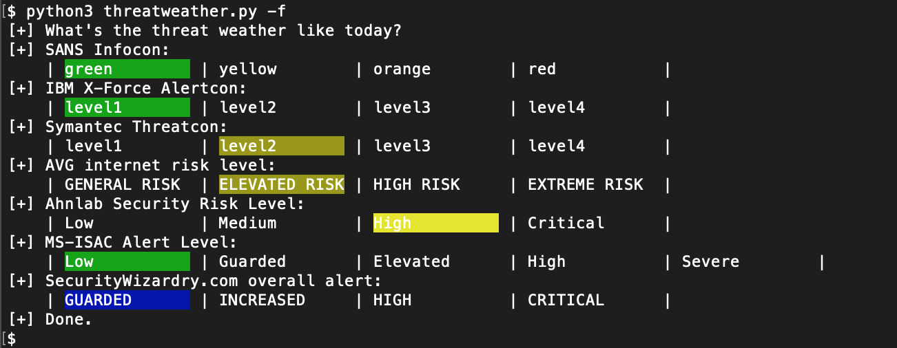

# ThreatWeather

  **ThreatWeather** is a tool to get Internet threat alert levels such as SANS infocon. This tool gets and displays the following alert levels:

  * [SANS Infocon](https://isc.sans.edu/infocon.html)
  * [IBM X-Force Alertcon](https://exchange.xforce.ibmcloud.com/)
  * [Symantec Threatcon](https://www.symantec.com/security_response/threatcon/)
  * [AVG internet Risk Level](https://www.avg.com/en-us/about-viruses)
  * [Ahnlab Security Risk Level](https://global.ahnlab.com/site/securitycenter/securitycenterMain.do)
  * [MS-ISAC Alert Level](https://www.cisecurity.org/cybersecurity-threats/)
  * [SecurityWizardry.com Overall Alert](https://www.securitywizardry.com/the-radar-page/overall-alerts)

    

## How to Install

### Clone ThreatWeather git repository
  ```shell
  $ git clone https://github.com/shu-tom/ThreatWeather.git
  ```
### Install python3 requirements
  ```shell
  $ pip3 install -r ThreatWeather/requirements.txt
  ```

## How to Use

  Use option **-f** to check all alert levels. Use **-h** to see help message.  
  ```shell
  $ python3 threatweather.py -f
  ```  
  * -f: All threaded level check
  * -l: Set the log file directory

### Post Twitter

  If you want to tweet the alert level, use option **-tweet**. This tool works on [@ThreatWeather](https://twitter.com/ThreatWeather).
